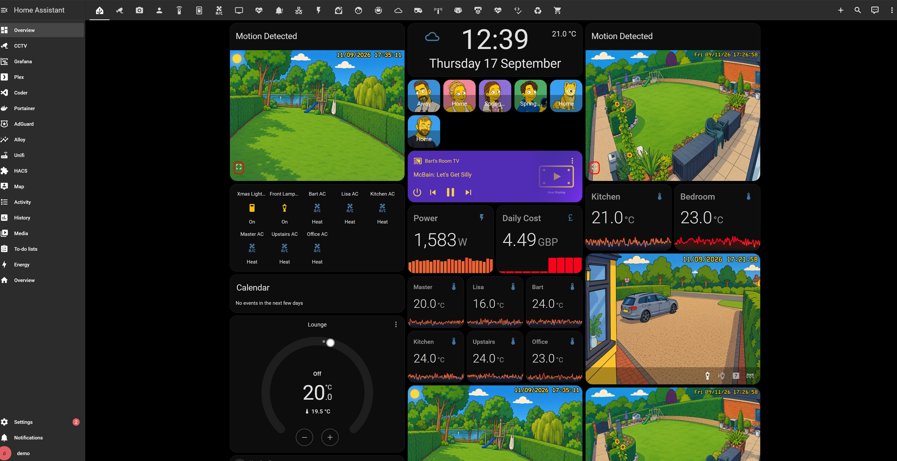
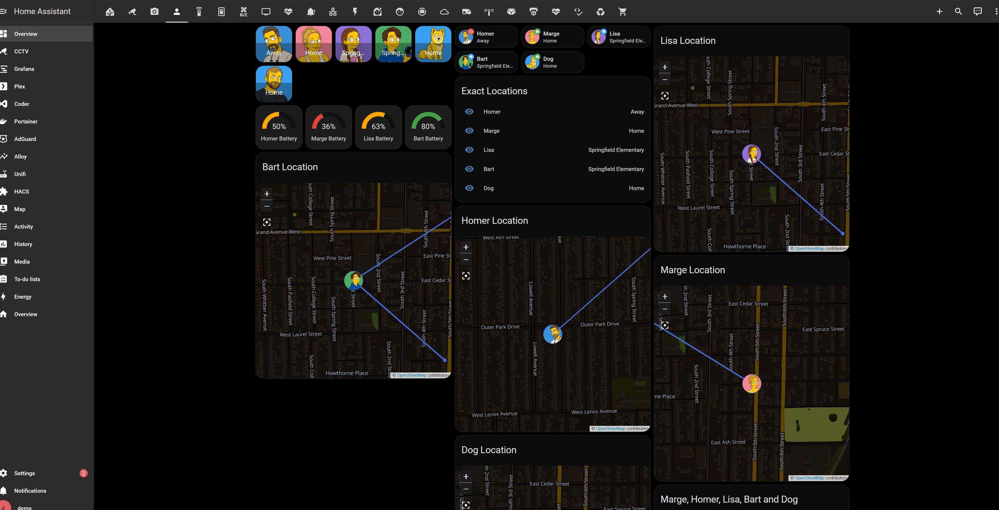
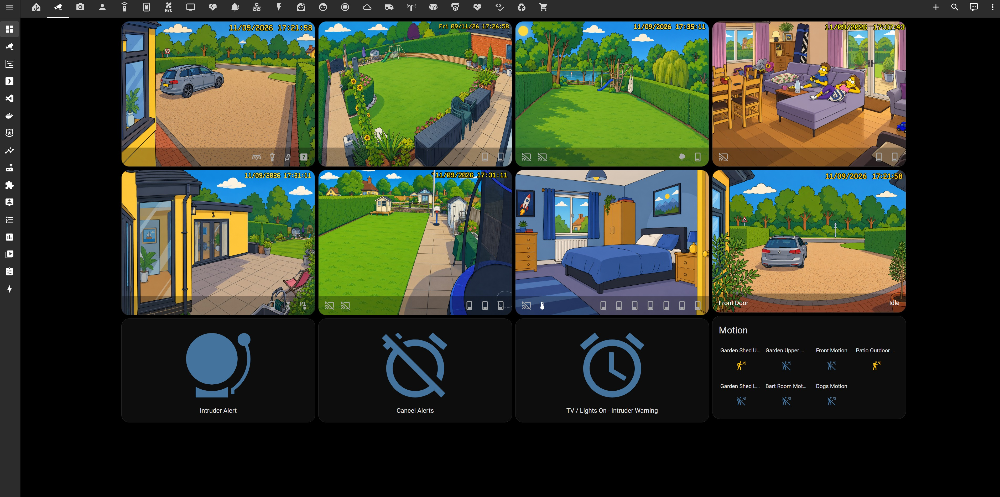
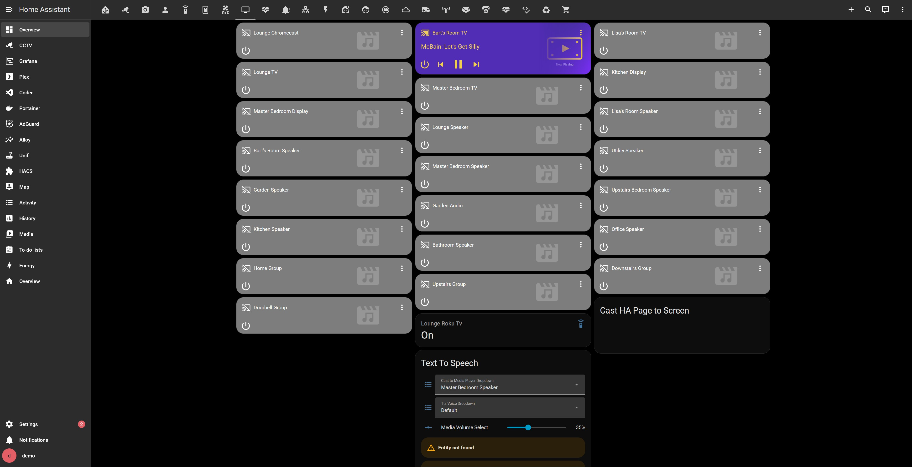
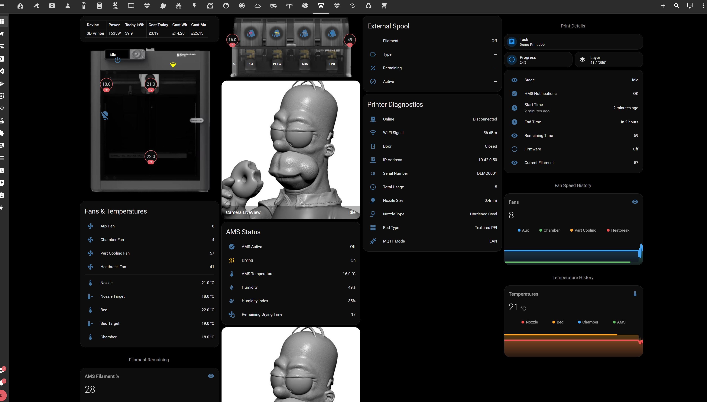
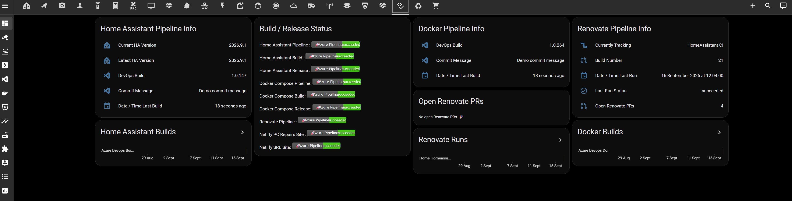

# Homer's Smart Home

A public Home Assistant showcase, built from my private home config with personal data
swapped for fictional Simpsons-themed demo data. Try the dashboard, then borrow whatever's
useful from the automations, scripts, and Lovelace YAML for your own setup.

This is a **sanitized mirror** of a private, actively-developed repo - see
[About this mirror](#about-this-mirror).

## Try the Home Assistant demo

- **In your browser:** click the badge above, sign in with GitHub, and wait a few minutes. It opens
  the dashboard automatically once it detects port `8123`; if your browser blocks the popup,
  open it manually from the **Ports** tab in the bottom panel.
- **Locally:** `docker run -p 8123:8123 ghcr.io/gavinwoolley/homeassistant-demo:latest`, then
  open <http://localhost:8123>.
- **From source:** see [`demo/README.md`](demo/README.md).

Both the Codespaces and Docker options land on a login screen - use `demo` / `demo`.

[`demo/`](demo/) runs the full Lovelace dashboard against fake data. Every sidebar entry other
than the dashboard itself (AdGuard, Portainer, Grafana, Plex, Coder, and the rest) is a
screenshot, not a running service, and the "Topology" tab (top of the Overview dashboard) is a
static image too - nothing inside Home Assistant links out to a real running service. A real
Grafana is available, just as a second, separate demo - see below.

## Try the Grafana observability demo

A second, standalone demo: a real Grafana, fed by Mimir/Loki/Alloy and provisioned with this
repo's entire dashboard catalogue (the Home Assistant dashboard above, the Grafana Arcade games,
everything under [`grafanaDashboards/dashboards/`](grafanaDashboards/dashboards/)). It's a
separate Codespace/container from the Home Assistant demo above, not the same one with Grafana
bolted on - a headless Home Assistant instance runs alongside Grafana purely to give it
something real to monitor, but isn't itself the point here and has no browsable UI wired up.

- **In your browser:** click the badge above, sign in with GitHub, and wait a few minutes for the
  images to pull - both Grafana and the underlying Home Assistant data source boot from
  pre-baked images here, so once the containers start they're both ready in seconds, not
  minutes. It opens on Grafana automatically once it detects port `3001`; the datasource wires
  itself up automatically too, no manual step, no login needed.
- **Locally:** see [`demo/README.md`](demo/README.md#optional-with-grafana-too) for the two-file
  `docker compose` command.

## Good places to borrow ideas from

- [`ui-lovelace.yaml`](ui-lovelace.yaml) - conditional cards that show useful controls and
  alerts only when they matter.
- [`automations.yaml`](automations.yaml) and [`scripts.yaml`](scripts.yaml) - day-to-day
  logic: heating schedules, irrigation with rain-skip, camera/motion handling, presence.
- [`themes/`](themes/) - the dark theme the dashboard runs. The custom Lovelace cards it
  depends on (mushroom, mini-graph, vacuum-card, and others) are installed via HACS, not
  vendored here, but the demo bundles static copies in
  [`demo/www/community/`](demo/www/community/) if you want the actual files.
- A few specific areas worth a look if you have the matching hardware: energy monitoring,
  camera/motion handling, heating, irrigation, and the Bambu Lab 3D printer integration - all
  in `configuration.yaml` and the two files above.

## Screenshots

[More in `docs/screenshots/`](docs/screenshots/) - click any image below to open it full-size.

| | |
| --- | --- |
|  |  |
| Main dashboard | People and location view, demo data |
|  |  |
| Camera grid with motion-triggered snapshots | Every speaker and TV, cast-to-room dropdowns |
|  |  |
| Bambu Lab AMS: per-tray filament, temps, camera | Build status, surfaced right in the dashboard |

## Also included

The repo also includes the Docker, monitoring and deployment configuration that supports the
private setup - Grafana, Prometheus/Mimir, Loki, a reverse proxy, DNS filtering, TLS
automation, and the CI/CD pipelines that deploy all of it. It is reference material only; the
Home Assistant demo runs independently. See [`docs/architecture.md`](docs/architecture.md)
for the diagram, dashboard catalogue, and deploy mechanics.

## About this mirror

The private source repo is never published directly. A [sanitizer](publish/) assembles an
allowlisted copy, redacts anything secret- or PII-shaped, checks the result against two
independent secret scans plus a dashboard-validity check, and only then pushes it here as a
single commit with no history of its own - every sync replaces the last rather than building
on it. Full rule set in [`publish/README.md`](publish/README.md).

## License

[MIT](LICENSE), Copyright (c) 2026 Gavin Woolley. Simpsons character names are used purely
as obviously-fictional placeholders for a personal, non-commercial project; no affiliation
with or endorsement by Disney/Fox.
