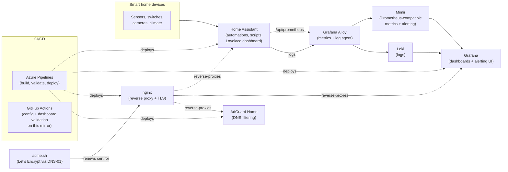
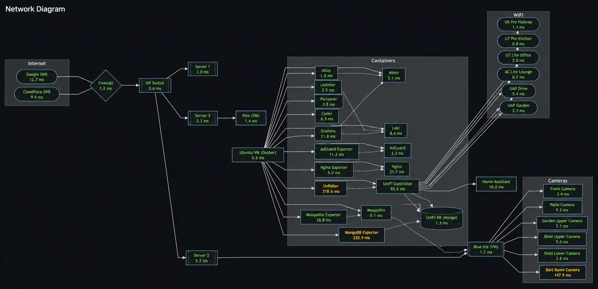
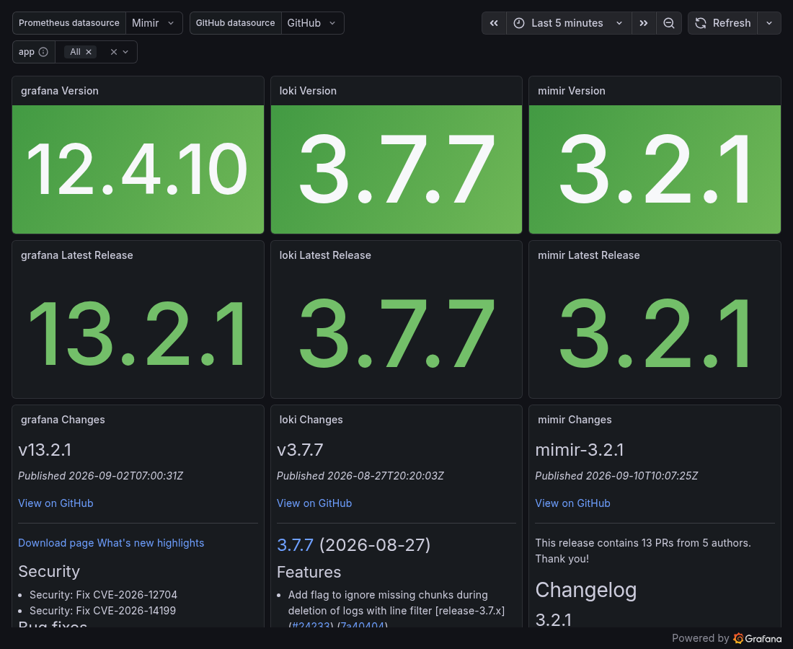
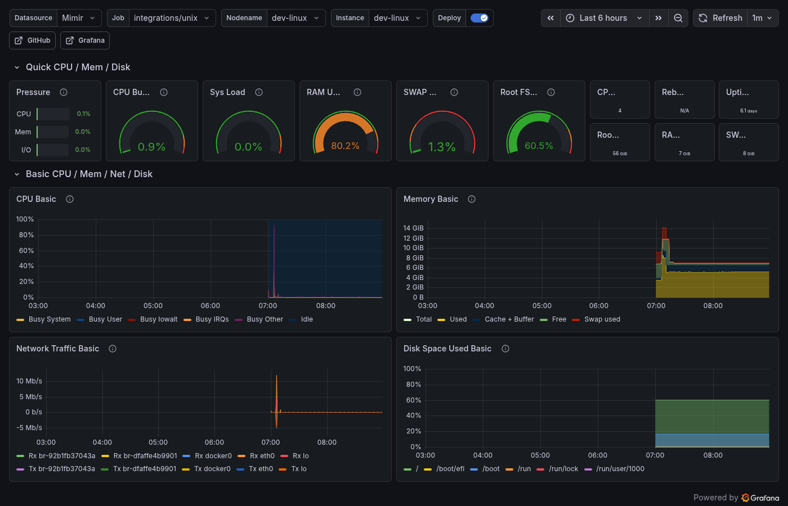
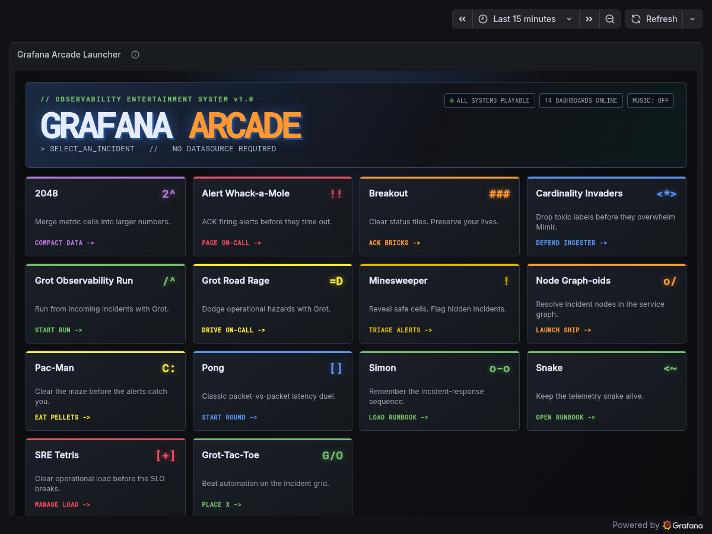

# Architecture

The rest of the stack the [dashboard](../README.md) runs alongside - reference material, not
part of the demo.

## What's in here

| Path | What it is |
| --- | --- |
| `configuration.yaml`, `automations.yaml`, `scripts.yaml`, `customize.yaml`, `switches.yaml`, `ui-lovelace.yaml` | Home Assistant core config - automations, scripts, and a hand-built Lovelace dashboard (YAML mode, not the UI editor) |
| `themes/` | The Lovelace theme in use, forced at startup |
| `custom_components/`, `www/` | Local HA integrations and vendored Lovelace cards |
| `esphome/` | ESPHome device configs |
| `docker-compose.yml` | The server stack: Grafana, Mimir, Loki, Alloy, blackbox-exporter, cAdvisor, AdGuard Home, Mosquitto, nginx, Portainer, and more - reference only, see [Try the Grafana observability demo](../README.md#try-the-grafana-observability-demo) |
| `grafanaDashboards/` | Every Grafana dashboard, datasource, and alert rule as code - see [Grafana dashboards](#grafana-dashboards) below and [`grafanaDashboards/README.md`](../grafanaDashboards/README.md) |
| `mimir/` | Prometheus alerting rules and Alertmanager routing - see [`mimir/README.md`](../mimir/README.md) |
| `nginx/`, `adguard/`, `acme/` | Reverse proxy, DNS filtering, and TLS certificate automation, as code |
| `azure-pipelines*.yml` | The CI/CD pipelines that build, validate, and deploy the private version of this repo (see [CI/CD](#cicd) below) - can't run here, but the config is unmodified |
| `demo/` | The isolated demo instance: the real Lovelace UI against fake data |
| `publish/` | The sanitizer that produces this repo from the private source, see [About this mirror](../README.md#about-this-mirror) |

## Grafana dashboards

Deployed as code (JSON files, no hand-editing in the UI - see
[`grafanaDashboards/README.md`](../grafanaDashboards/README.md) for the deploy mechanics and
datasource details). A few worth a look:

| | |
| --- | --- |
|  |  |
| [`Topology.json`](../grafanaDashboards/dashboards/Topology.json) - a network map generated from blackbox-exporter reachability probes, not drawn by hand. Regenerated by [`build_ha_dashboard.py`](../grafanaDashboards/build_ha_dashboard.py) whenever a device is added | [`LGTM/LGTM Versions Releases.json`](../grafanaDashboards/dashboards/LGTM/LGTM%20Versions%20Releases.json) - checks every LGTM stack component's running version against its latest GitHub release |
|  |  |
| [`node-exporter/Node Exporter Full.json`](../grafanaDashboards/dashboards/node-exporter/Node%20Exporter%20Full.json) - the classic community dashboard, for the Docker host itself | [`Games/`](../grafanaDashboards/dashboards/Games/) - playable games built as dashboard panels: 2048, Pac-Man, Snake, Breakout, Asteroids, Minesweeper, Pong, Simon, Tic-Tac-Toe, and a few others |

Also in there: [`Home Assistant.json`](../grafanaDashboards/dashboards/Home%20Assistant.json),
the main dashboard (generated by the same `build_ha_dashboard.py` script, not hand-built
panel JSON); an `LGTM/` folder monitoring the observability stack's own health;
`Alerting/Alerting Overview.json`; and per-service dashboards for AdGuard, Mosquitto,
MongoDB, nginx, UniFi, cAdvisor, Alloy, and both Linux and Windows hosts.

## Observability

Monitoring runs on the LGTM stack (Grafana, Loki, Mimir, Alloy), plus blackbox-exporter for
network reachability, cAdvisor for container stats, and per-service exporters (AdGuard,
Mosquitto, MongoDB, nginx, UniFi).

- **Metrics** flow through Alloy into Mimir (Prometheus-compatible). Home Assistant exposes
  `/api/prometheus` directly: every entity becomes a `homeassistant_*` series labelled by
  `entity` and `friendly_name`.
- **Logs** flow through Alloy into Loki, keyed by `service_name`.
- **Dashboards, datasources, and alert rules are code** in `grafanaDashboards/` and `mimir/`,
  deployed by pipeline rather than clicked together in the UI. The deploy step re-mirrors the
  host directory from the repo on every run, so the host always matches what's committed.
- **Deploys, reboots, and service events show up as annotations on the dashboards** - a
  deploy renders as a shaded time-span across every panel, not just a log line elsewhere.

## CI/CD

The private source repo runs on Azure DevOps Pipelines (the `azure-pipelines*.yml` files here
are the unmodified pipeline definitions). One pipeline builds and deploys the Home Assistant
config, a second deploys the Docker Compose stack, and a third runs Renovate nightly to keep
container images and dependencies current. Both deploy pipelines validate before shipping:
Home Assistant's own `check_config`, JSON-parsing every dashboard file, duplicate-uid
detection across the dashboard set, `docker-compose config`, and `mimirtool` rule validation
all have to pass first.

Those pipelines can't run against this mirror (they deploy to a private home server), so this
repo carries its own GitHub Actions instead, covering the parts of that same validation that
make sense standalone - see the badges at the top.

## Tech stack

Home Assistant · Docker / Docker Compose · Grafana · Mimir · Loki · Grafana Alloy ·
Prometheus (blackbox-exporter, cAdvisor, node/windows-exporter) · AdGuard Home · Mosquitto ·
nginx · MongoDB · ESPHome · acme.sh + Let's Encrypt · Azure DevOps Pipelines · GitHub Actions
· Renovate · Python
